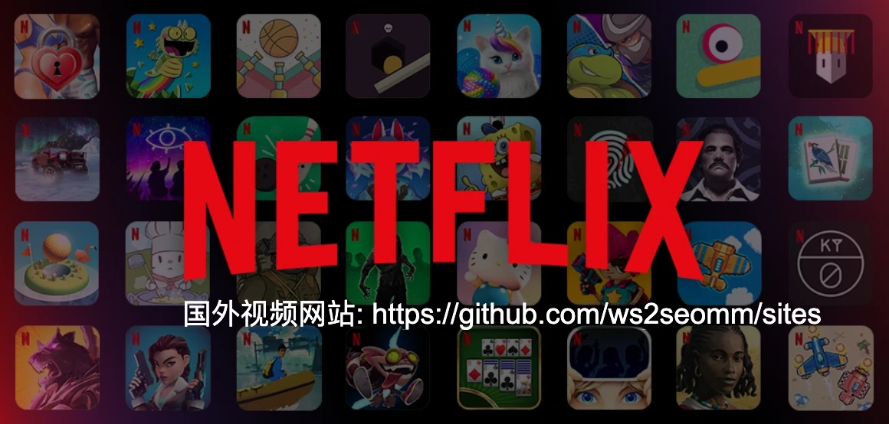
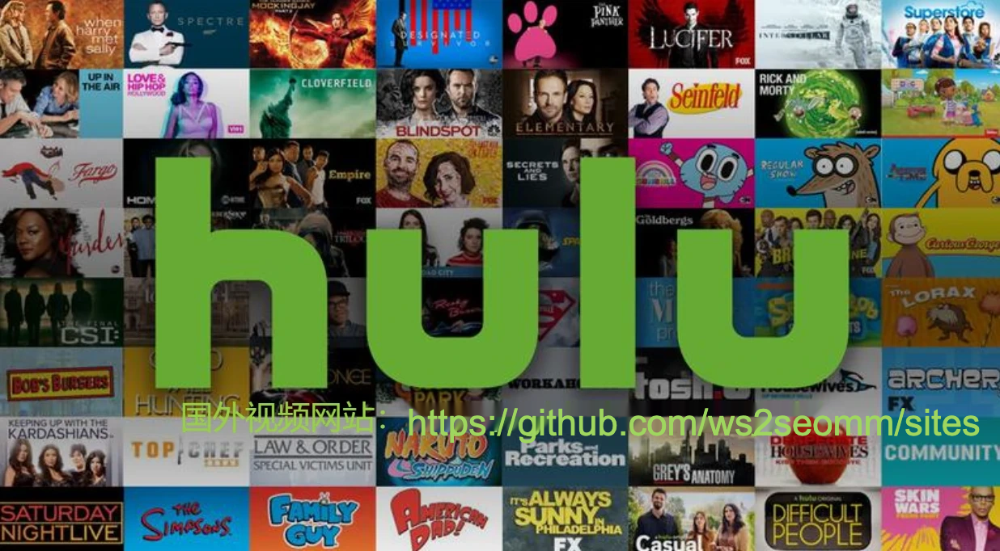
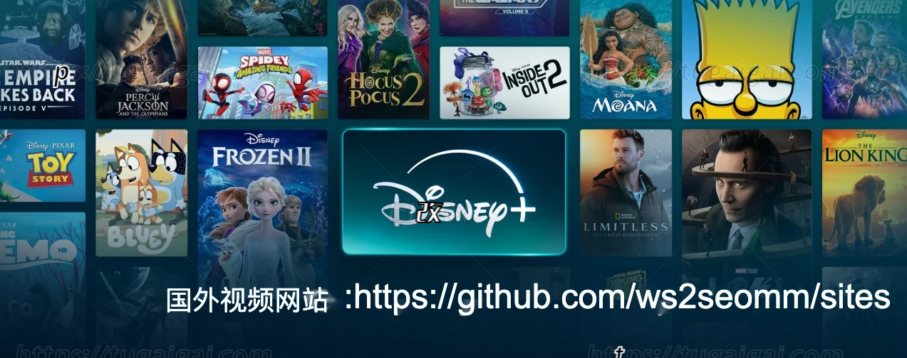
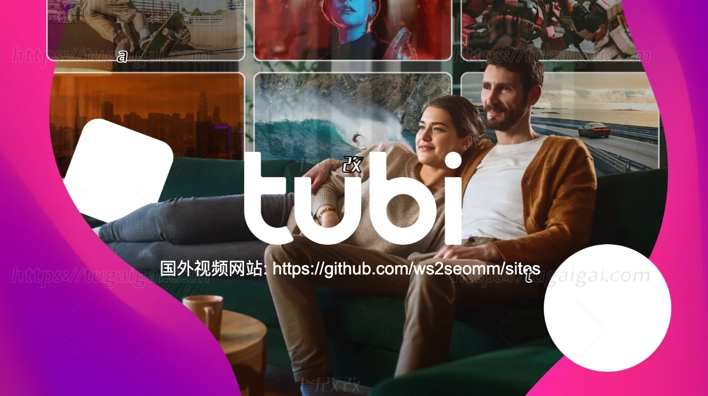
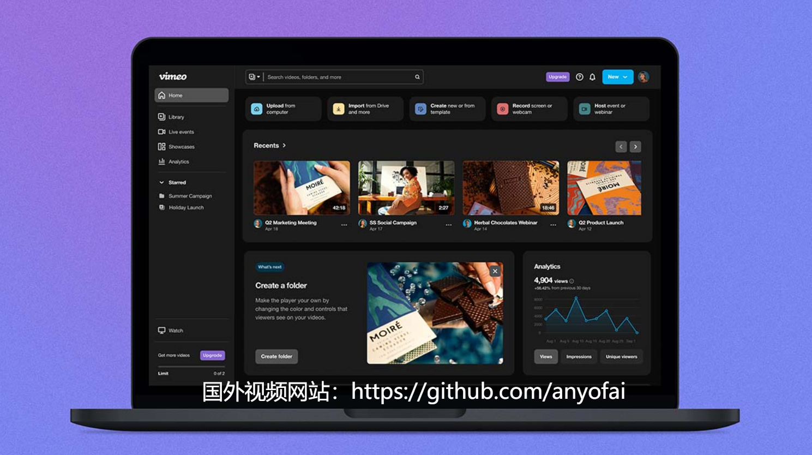

# 
2026年最新国外视频网站和免费电影网站推荐

最近更新于：2026年2月2日

现如今上网看电影、追剧、看综艺和观看直播已经成为许多人主要的娱乐方式。在国内，大家比较熟悉的视频网站有腾讯视频、爱奇艺、优酷、土豆等。不过，很多网友已不满足于国内的视频资源，也希望了解一些值得浏览和收藏的国外视频网站。

此外，对于身处美国、加拿大、澳大利亚、新加坡等国家的华人朋友来说，由于版权和地域限制，许多国内视频网站（如腾讯视频、爱奇艺、优酷等）在海外访问时经常会弹出“由于地域限制，无法播放”的提示。这使得许多海外华人无法正常观看国内的视频内容，只能苦苦寻找能够观看国内视频的替代方案。

接下来，我们将为大家推荐五个最受欢迎的国外付费视频网站和五个最受欢迎的国外免费视频网站，中国大陆用户可以根据自己的实际需求选择适合的平台。我们还会为大家推荐十个最新的海外免费电影网站，这样大家即便身处海外，也可以自由观看大陆的电视剧、综艺等节目。

<blockquote>

**注意**：如果你在中国大陆**无法正常访问Netflix等国外视频网站**，或者觉得这些流媒体服务的**订阅价格过高**，那么可以通过“**<a href="https://nf.video/BTgSc">银河录像局</a>**”来**合租Netflix、Disney+、HBO MAX、Prime Video、YouTube等流媒体账号**。银河录像局是一家专注于流媒体账号和AI工具账号合租的平台，已在浙江完成备案（浙ICP备2022036459号，ICP经营许可证：浙B2-20230847）。该平台安全可靠，价格实惠，**Netflix合租价格低至8.9元起**，即可享受与原版账号完全相同的服务。如需了解更多详细信息，请参阅《<a href="https://github.com/anyofai/netflix-hezu">Netflix合租</a>》或《<a href="https://github.com/anyofai/youtube-hezu">YouTube合租</a>》。

</blockquote>

## 国外排名前五的付费视频网站推荐

对于中国美剧爱好者来说，选择一个合适的国外视频网站至关重要。现在各大海外视频网站竞争激烈，每家都有自己的独门绝技和王牌内容。虽然这些平台需要付费订阅，但观影体验确实不是免费网站能比的，不仅没有广告干扰，画质也更清晰，而且很多热门的独家剧集只有在这些平台才能看到。接下来我们为大家推荐五个最受欢迎的国外付费视频网站，大家可以根据自己的需求选择。

### 一、Netflix

网址：https://www.netflix.com

Netflix是全球最大的流媒体平台，拥有超过两亿活跃用户。在这里，几乎可以找到所有你想看的热门美剧，从《纸牌屋》到《怪奇物语》，原创内容质量非常高。除了美剧，韩剧资源同样丰富，如《鱿鱼游戏》《王国》等爆款剧集都是Netflix独家制作。此外，其画质支持4K HDR，只要网速足够，观影体验非常出色。需要注意的是，国内用户需通过科学上网才能访问Netflix官网，订阅费用约为每月7.99美元起。

### 二、Hulu

网址：https://www.hulu.com

Hulu是美国非常受欢迎的流媒体平台，最大特色是电视台播出的节目通常会在次日上线。如果你错过了前一天的热门综艺或电视剧，第二天就能在Hulu上补看。除了电视节目，Hulu还拥有不少高质量的原创剧集，《使女的故事》就是代表作之一。Hulu提供有广告版和无广告版两种套餐，有广告版每月约6美元，无广告版约12美元。不过，Hulu主要面向美国用户，海外访问有较严格的限制。

### 三、Disney+

网址：https://www.disneyplus.com

迪士尼的流媒体服务主打家庭娱乐，漫威、星球大战、皮克斯的动画片应有尽有。如果你是漫威粉丝，这里有《洛基》《旺达幻视》等独家剧集，还能重温所有漫威电影宇宙的作品。迪士尼的经典动画电影同样是一大亮点，从《狮子王》到《冰雪奇缘》都能找到。Disney+的订阅费用相对便宜，每月大约8美元，但内容较为垂直，更适合有孩子的家庭或超级英雄爱好者。

### 四、HBO Max

网址：https://www.hbomax.com

HBO一直以高质量剧集著称，《权力的游戏》《西部世界》《继承之战》都出自这个平台。与其他流媒体相比，HBO Max更注重剧情深度和成熟题材，无论故事内容还是制作水准都非常出色。除了自制剧，平台还收录了大量华纳兄弟的院线电影，有些新片甚至会与院线同步上线。不过，这个平台对网络环境要求较高，内容更新速度也相对较慢，订阅费用每月约为15美元。

### 五、Amazon Prime Video

网址：https://www.primevideo.com

亚马逊的视频服务其实是Prime会员的附加福利，但内容质量同样值得肯定。《了不起的麦瑟尔夫人》《黑袍纠察队》等原创剧集口碑都很不错。最大优势在于，如果你本身就是亚马逊用户，Prime会员不仅可以观看视频，还能享受购物免邮等多项服务，整体性价比很高。该平台的电影资源非常丰富，尤其收录了不少小众独立电影。Prime Video的界面设计简洁，但有时候查找影片并不方便。

## 国外排名前五的免费视频网站推荐

如果你不愿意花钱订阅Netflix等流媒体，好在网上还有不少质量不错的免费视频网站。虽然可能会有些广告，画质也不如付费平台，但胜在完全免费，而且资源更新也挺及时。下面就为大家推荐几个口碑比较好的海外免费视频网站，让你不花一分钱也能追到最新的影视作品。

### 一、YouTube

网址：https://www.youtube.com

YouTube毫无疑问是全球最大的免费视频分享平台，内容非常的丰富。从娱乐搞笑到教育科普，从音乐MV到电影预告，几乎所有类型的视频都能在这里找到。许多创作者会上传完整的电影、纪录片和剧集，虽然画质可能参差不齐，但胜在资源丰富且更新及时。YouTube的算法推荐系统非常智能，能够根据你的观看历史精准推送感兴趣的内容。作为海外免费视频网站的代表，YouTube在全球范围内都能正常访问，但国内用户需要科学上网后才能观看。

### 二、Tubi

网址：https://www.tubi.tv

Tubi是福克斯旗下的免费流媒体服务，专门提供正版电影和电视剧。这个国外免费视频网站的片库质量相当不错，从好莱坞大片到独立制作的电影都有收录。虽然观看过程中会插播广告，但相比付费平台的订阅费用，这点小代价完全可以接受。Tubi的分类系统非常细致，你可以按照类型、年代、评分等多种方式筛选影片。Tubi界面设计简洁明了，用户体验非常友好，不过目前主要服务于北美地区用户。

### 三、Crackle

网址：https://www.crackle.com

索尼影业推出的Crackle走精品路线，虽然内容数量不如其他免费视频网站庞大，但质量控制的非常严格。Crackle上能找到不少索尼出品的经典电影和热门剧集，还有一些独家的原创内容值得关注。Crackle的广告频率控制得比较合理，不会过度影响观影体验。Crackle特别适合那些追求画质和内容品质的用户，每部作品都经过精心挑选。唯一的遗憾是Crackle更新速度相对较慢，而且地区访问限制比较严格。

### 四、Vimeo

网址：https://www.vimeo.com

Vimeo在海外视频网站中属于独树一帜的存在，以高质量的艺术类和创意类视频著称。这里聚集了大量独立电影制作人、艺术家和创意工作者，你能看到很多在其他平台找不到的优质短片和纪录片。Vimeo对视频质量要求很高，支持4K甚至8K分辨率播放，观影体验非常出色。Vimeo几乎没有恶俗内容，整体氛围高雅。对于喜欢小众艺术片和实验电影的观众来说，Vimeo绝对是个宝藏平台，而且全球用户都能正常访问。

### 五、Twitch

网址：https://www.twitch.tv

Twitch虽然主要以游戏直播闻名，但实际上这个平台的内容远比想象中丰富。除了游戏直播，还有音乐表演、艺术创作、聊天互动等多种类型的实时内容。许多主播会在直播间播放电影、动漫或综艺节目，观众可以一边观看一边聊天互动，体验非常独特。作为国外免费视频网站中的新秀，Twitch的社交属性很强，你可以认识来自世界各地的朋友。Twitch对内容审核较为严格，整体环境较为健康，而且全天候都有新鲜内容更新。

## 2026年最新海外免费电影网站推荐

对于海外华人来说，想看国产热播剧却因为地域限制无法访问腾讯视频、爱奇艺等平台，这种痛苦相信很多人都体验过。同样，国内用户想追Netflix、HBO上的欧美大片，但又不想为了几部剧专门订阅这些昂贵的海外平台。幸好现在有不少专门的免费电影网站能够解决这些问题，这些平台汇聚了全球各地的影视资源，让你无论身在何处都能自由观看。下面我们为大家推荐几个资源丰富、更新及时的海外免费电影网站，帮你打破地域壁垒，畅享全球影视内容。

### 一、爱壹帆国际版

网址：https://iyf.world/

爱壹帆作为海外免费电影网站中的佼佼者，其最大亮点在于强大的资源聚合能力。爱壹帆会实时抓取全网优质影视资源，无论是最新上映的院线大片还是经典老电影，基本都能在这里找到。爱壹帆不仅支持在线观看，还提供下载功能和字幕匹配服务，这在同类网站中相当少见。最让人印象深刻的是它的搜索算法，输入影片关键词后能快速定位到多个播放源，用户可以根据网速情况选择最适合的线路。对于经常为找片源而头疼的观众来说，这个国外免费电影网站绝对是个宝藏级的存在。

### 二、人人电影

网址：https://renren.video/

人人电影给人的第一印象就是界面干净整洁，完全没有那些令人讨厌的弹窗广告和乱七八糟的推广链接。这个海外免费看片网站的页面加载速度相当出色，基本上点击播放按钮就能立即开始观看，很少遇到长时间缓冲的情况。人人电影的内容非常丰富，从热门电影到冷门纪录片都有收录，分类标签做得很细致，用户可以轻松找到自己感兴趣的内容。人人电影网站右上角的搜索功能反应灵敏，支持模糊搜索和关键词联想，大大提升了找片效率。

### 三、低端影视

网址：https://ddys.io/

低端影视这个名字听起来很谦逊，但实际上它是免费电影网站中的高品质代表。这个平台的运营理念很独特，不追求数量而专注质量，主要收录那些真正值得一看的经典影片和新上映的精品作品。每部电影都经过站长的精心筛选，确保观众不会浪费时间在烂片上。低端影视最大的特色是提供无删减完整版本，让观众能够看到导演最初的完整创作意图。这里的用户群体相对成熟，评论区的讨论质量很高，经常能看到深度的影片分析和推荐，形成了一个小而精的观影社区。

### 四、一帆视频

网址：https://yfsp.app/

一帆视频堪称海外免费电影网站中的更新速度之王，同属于爱壹帆品牌旗下，拥有超过20万部国内外影片资源，最令人惊叹的是它的同步速度。一般情况下，热门影片的官方版本发布后，在5到30分钟内就能在嗯哩TV上免费观看，这种更新效率在同类平台中几乎无人能及。一帆视频的网站界面设计非常现代化，采用了响应式布局，无论是在电脑还是手机上观看都有很好的视觉体验。一帆视频的搜索和筛选功能特别强大，支持按类型、年份、地区、评分等多种条件组合查找，还能保存个人的观影历史和收藏夹。

### 五、missavbet

网址：https://missav.bet/

missavbet在海外华人观影圈中享有很高的声誉，特别是在北美地区的播放体验相当出色。这个免费电影网站针对海外网络环境做了专门优化，即使是高清1080P视频也能做到秒开无缓冲，这对于网络条件相对复杂的海外用户来说非常难得。missavbet的内容质量控制严格，每部影片都经过测试确保能够正常播放，很少出现链接失效或画质糟糕的情况。该网站的更新频率稳定，经常能找到一些在其他平台难以找到的小众佳片和独立电影(懂的自然懂)，是许多影迷的私藏网站。

### 六、aiyifan

网址：https://aiyifan.homes/

aiyifan在海外用户中享有不错的口碑，主要得益于其出色的播放性能和丰富的内容库。aiyifan提供最新的在线电影、电视剧、综艺、动漫、纪录片、体育等全方位娱乐资源，基本能满足不同用户的观影需求。aiyifan最让人印象深刻的是其在海外的播放速度，针对海外网络环境做了专门的优化，基本上能做到即点即播，很少出现令人讨厌的卡顿和缓冲现象。aiyifan的资源更新相当及时，热门新片和热播剧集通常能在官方发布后很短时间内上线。aiyifan的网站界面设计简洁明了，没有复杂的注册流程和繁琐的操作步骤，用户可以直接搜索想看的内容开始观影，这种直接了当的设计理念特别适合那些只想安静看片、不喜欢被各种功能干扰的观众。

### 七、ifun

网址：https://www.duboku.tv/

ifun顾名思义是专注于电视剧资源的聚合和播放，可以说是追剧党爱饭们的天堂。这个平台不仅收录了国产热播剧，还有大量的英美剧、日韩剧、泰剧等海外作品，基本上涵盖了全球主要影视制作地区的电视剧作品。ifun的一大特色是提供详细的剧集信息和评分系统，用户可以根据其他观众的评价来选择值得追的剧集。而且在播放过程中几乎没有广告打断，这在海外免费电影网站中相当难得。更新速度也很快，热播剧集通常能在官方播出后很短时间内上线。

### 八、iyf tv

网址：https://iyf.homes/

iyf tv在免费电影网站圈子里可谓大名鼎鼎，知名度相当高。这个平台的资源库异常丰富，从最新的院线大片到经典老电影，从热门电视剧到小众纪录片，基本上能满足各种观影需求。iyf tv的播放流畅度在同类网站中表现不俗，服务器稳定性也比较好。不过需要注意的是，免费用户只能观看480P标清画质，如果想要更高清的观影体验需要购买会员。而且在播放过程中会有广告插播，但频率不算太高，对于免费服务来说完全可以接受。

### 九、泥巴影院

网址：https://nbyy.pro/

泥巴影院在用户体验方面做得相当用心，页面加载速度快，界面设计干净整洁，没有那些令人烦躁的弹窗广告和恶意跳转。这个海外免费看片网站的分类系统做得很详细，不仅有常规的类型分类，还提供了年代、地区、评分等多维度的筛选选项，帮助用户快速找到心仪的影片。该网站还设有专门的新片上线区域，会及时推荐最新上映的热门电影。大部分影片都提供1080P清晰度，画质表现令人满意，是个非常值得收藏的免费观影平台。

### 十、星辰影视

网址：https://nbyy.live/

星辰影视最大的亮点就是纯净的观影环境，整个网站完全没有广告，连视频播放过程中也不会有任何广告打断，这在当今的免费电影网站中简直是一股清流。该网站的资源更新及时，热门新片上线速度很快，画质清晰度也维持在不错的水平。星辰影视的界面设计追求简洁实用，没有复杂的操作流程和华而不实的装饰元素，特别适合那些只想安静看片、不喜欢被各种广告和推广信息打扰的用户。对于追求纯粹观影体验的观众来说，这个国外免费视频网站绝对值得一试。

## 国外视频网站相关的其他文章：

* <a href="https://github.com/anyofai/anyofai.github.io">ChatGPT Plus购买</a>：如何购买/合租/代充ChatGPT Plus会员？如何购买Codex拼车服务？
* <a href="https://github.com/anyofai/claude-pro">Claude Pro订阅</a>：如何注册Claude账号？如何购买/合租/代充Claude Pro会员？含Claude Code国内使用教程！
* <a href="https://github.com/anyofai/midjourney">Midjourney订阅</a>：如何购买Midjourney原生独立账号？如何代充Midjourney会员？
* <a href="https://github.com/anyofai/poe">Poe订阅</a>：Poe会员支持GPT-5.1、Claude 4.5 Sonnet、Grok-4.1、Gemini-3 Pro等大模型！
* <a href="https://github.com/anyofai/x-twitter">SuperGrok订阅</a>：如何合租SuperGrok会员？如何购买SuperGrok账号？如何代充SuperGrok会员？
* <a href="https://github.com/anyofai/gemini-pro">Gemini Pro购买</a>：如何购买Gemini Pro账号？如何合租Gemini Pro会员？如何为Gemini Pro代充值？

* <a href="https://github.com/anyofai/chatgpt-plus-hezu">ChatGPT Plus合租</a>：支持ChatGPT-5.1、DeepSeek-R1、Grok-4.1和Gemini-3 Pro等大模型！每月仅需27元！
* <a href="https://github.com/anyofai/claude-pro-hezu">Claude Pro合租</a>：无需科学上网，镜像直连，会话隔离，保障隐私安全，无账号被封风险！价格低至14元起！
* <a href="https://github.com/anyofai/midjourney-hezu">Midjourney合租</a>：提供国内镜像直连、官方标准会员合租、官方Pro会员合租等三种服务！每月仅需27元！
* <a href="https://github.com/anyofai/netflix-hezu">Netflix奈飞合租</a>：提供独立子账号、支持设置pin码，可访问Netflix全球影视资源，全程质保，价格低至8元起！
* <a href="https://github.com/anyofai/youtube-hezu">YouTube合租</a>：安全有保障，可享受YouTube Premium会员所有权益！每月仅需15元！
* <a href="https://github.com/anyofai/spotify-hezu">Spotify合租</a>：官方渠道采购，品质有保障！可享Spotify Premium所有权益！每月仅需13.5元！

* <a href="https://github.com/anyofai/chatgpt">ChatGPT注册</a>：最新的ChatGPT账号注册详细操作步骤，以及ChatGPT账号购买指南！
* <a href="https://github.com/anyofai/chatgpt-plus-recharge">ChatGPT Plus代充值</a>：推荐最稳定可靠的ChatGPT Plus代充值平台，价格优惠，信誉有保障。
* <a href="https://github.com/anyofai/claude-pro-recharge">Claude Pro代充值</a>：提供纯人工充值服务，价格实惠，24小时在线客服，独享Claude Pro原生账号！
* <a href="https://github.com/anyofai/nf-video">银河录像局</a>：最靠谱的AI工具和流媒体合租平台！使用优惠码ANYOFAI可享九折优惠！
